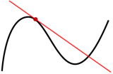
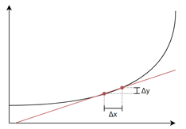
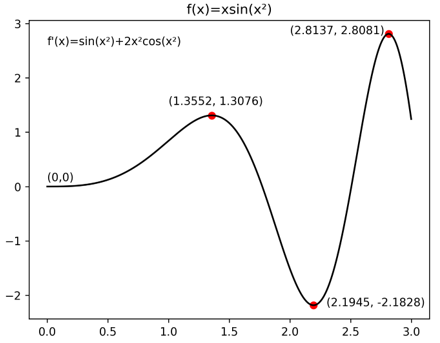
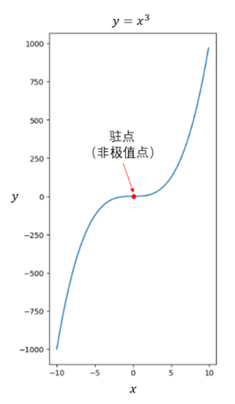
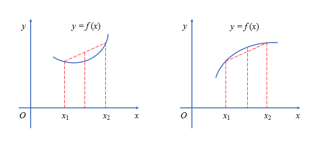
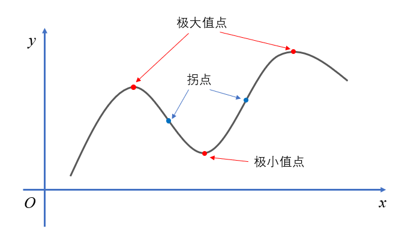
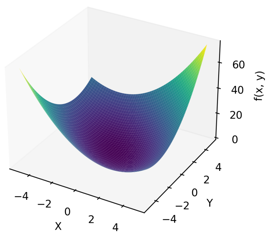
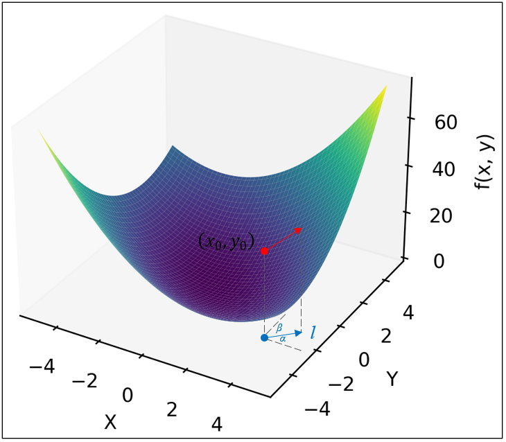
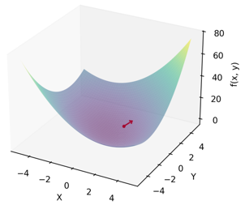

# 高等数学

---

## 1.1 导数（Derivative）

### 1.1.1 导数的概念

**直观理解**

* 导数 = 函数在某一点的**瞬时变化率**
* 在图像上，就是这一点的**切线斜率**
* 思想：用极限，把“很小的变化”当成“无限小”，看函数局部像一条直线的程度（局部线性逼近）

**严格定义**

设函数 $y=f(x)$，在点 $x_0$ 附近可取增量 $\Delta x$，对应函数值的增量为
$$
\Delta y = f(x_0+\Delta x)-f(x_0)
$$

如果极限
$$
f'(x_0)
=\lim_{\Delta x \to 0} \frac{\Delta y}{\Delta x}
=\lim_{\Delta x \to 0} \frac{f(x_0+\Delta x)-f(x_0)}{\Delta x}
$$
存在，就称 $f$ 在 $x_0$ 处**可导**，这个极限就是 $f$ 在 $x_0$ 处的导数，记作：

* $f'(x_0)$
* $\dfrac{df}{dx}(x_0)$
* 或 $\left.\dfrac{df}{dx}\right|_{x=x_0}$

**物理例子：速度**

设物体的位置是时间的函数 $x=x(t)$，则：

* 一段时间 $\Delta t$ 内的平均速度：
  $$
  \bar v = \frac{\Delta x}{\Delta t}
  $$
* 当 $\Delta t \to 0$ 时的极限，就是**瞬时速度**：
  $$
  v(t) = \lim_{\Delta t \to 0} \frac{\Delta x}{\Delta t} = \frac{dx}{dt}
  $$

> 导数用来描述“此刻变化有多快”，是优化问题、物理建模、机器学习训练（梯度下降）的核心概念。

---

### 1.1.2 基本函数的导数

下面是最常用的基础导数公式。

| 说明    | 函数         | 导数公式                                           | 示例                                |
| ----- | ---------- | ---------------------------------------------- | --------------------------------- |
| 常数的导数 | $C$        | $(C)' = 0$                                     | $3' = 0$                          |
| 幂函数   | $x^\alpha$ | $(x^\alpha)' = \alpha x^{\alpha-1}$            | $(x^3)' = 3x^2$                   |
| 指数函数  | $a^x$      | $(a^x)' = a^x \ln a$                           | $(3^x)' = 3^x \ln 3$              |
|       | $e^x$      | $(e^x)' = e^x$                                 | —                                 |
| 对数函数  | $\log_a x$ | $(\log_a x)' = \dfrac{1}{x \ln a}$             | $(\log_3 x)' = \dfrac{1}{x\ln 3}$ |
|       | $\ln x$    | $(\ln x)' = \dfrac{1}{x}$                      | —                                 |
| 三角函数  | $\sin x$   | $(\sin x)' = \cos x$                           | —                                 |
|       | $\cos x$   | $(\cos x)' = -\sin x$                          | —                                 |
|       | $\tan x$   | $(\tan x)' = \sec^2 x = \dfrac{1}{\cos^2 x}$   | —                                 |
|       | $\cot x$   | $(\cot x)' = -\csc^2 x = -\dfrac{1}{\sin^2 x}$ | —                                 |

* 上表是之后一切求导计算的“原子操作”。

> 这些基本导数是所有复杂函数求导的“零件库”，后面用求导法则把它们拼起来。

---

### 1.1.3 导数的求导法则

在基本函数之上，通过几条组合规则，可以给复杂函数求导。

#### 常见法则

设 $f(x), g(x)$ 都可导，$c$ 为常数。

1. **和的求导**

   $$
   (f+g)' = f' + g'
   $$

2. **常数倍的求导**

   $$
   (c f)' = c f'
   $$

3. **积的求导**

   $$
   (fg)' = f'g + fg'
   $$

4. **商的求导**

   若 $g(x)\neq 0$，则
   $$
   \left(\frac{f}{g}\right)'
   =\frac{f'g - fg'}{g^2}
   $$

5. **复合函数（链式法则）**

   若 $f(x) = h(g(x))$，则
   $$
   f'(x) = h'(g(x)) \cdot g'(x)
   $$

---

#### 示例：计算具体函数的导数

**例子**

求函数
$$
f(x) = \frac{x^4 + \sin x^2 - \ln x}{e^x + 7}
$$
在 $x=3$ 处的导数 $f'(3)$。

**步骤 1：拆成 $u(x)$ 和 $v(x)$**

* 分子：$u(x) = x^4 + \sin x^2 - \ln x$
* 分母：$v(x) = e^x + 7$

**步骤 2：分别求导**

* $u'(x)$：
  $$
  (x^4)' = 4x^3,\quad
  (\sin x^2)' = \cos x^2 \cdot 2x,\quad
  (-\ln x)' = -\frac{1}{x}
  $$
  所以
  $$
  u'(x) = 4x^3 + 2x\cos x^2 - \frac{1}{x}
  $$

* $v'(x)$：
  $$
  v'(x) = (e^x)' = e^x
  $$

**步骤 3：用商的求导公式**

$$
f'(x)
= \frac{u'(x)v(x) - u(x)v'(x)}{[v(x)]^2}
$$

代入得到：
$$
f'(x)
= \frac{\Big(4x^3 + 2x\cos x^2 - \frac{1}{x}\Big)(e^x + 7)
- (x^4 + \sin x^2 - \ln x)e^x}{(e^x + 7)^2}
$$

**步骤 4：求 $f'(3)$**

把 $x=3$ 代入：
$$
f'(3)
= \frac{\Big(4\cdot 3^3 + 2\cdot 3\cos 9 - \frac{1}{3}\Big)(e^3 + 7)
- (3^4 + \sin 9 - \ln 3)e^3}{(e^3 + 7)^2}
$$

不需要展开成具体数值，保留成上面这种“代入表达式”即可。

> 求导法则让我们可以“模块化”地算复杂函数的导数，是做解析求导、推导梯度公式的标准套路。

---

### 1.1.4 利用导数求极值

**几个关键词**

* **驻点**：导数为 0 的点，$f'(x_0)=0$。
* 驻点是“极值可疑点”：可能是极大值、极小值，也可能啥都不是。

**基本思路**

1. 先解方程 $f'(x)=0$，找出所有驻点。
2. 再观察导数在这些点左右的符号变化，判断是极大还是极小。

**符号判断**

* 若在 $x_0$ 左侧 $f'(x)>0$、右侧 $f'(x)<0$，函数先升后降 → **极大值点**。
* 若在 $x_0$ 左侧 $f'(x)<0$、右侧 $f'(x)>0$，函数先降后升 → **极小值点**。
* 若符号不变（都为正或都为负），则不是极值点。

**反例：$f(x)=x^3$**

$$
f(x) = x^3,\quad f'(x) = 3x^2
$$

* 在 $x=0$ 处有 $f'(0)=0$，是驻点；
* 但 $x<0$ 和 $x>0$ 时 $f'(x)=3x^2\ge 0$，左右两边导数同号，都不小于 0，函数在这里只是“平缓经过”，没有极大或极小。

所以：**导数为 0 ≠ 一定有极值**。

> 导数配合符号分析，是寻找函数“最高点 / 最低点”（比如损失函数最小值）的基础方法。

---

### 1.1.5 二阶导数与凹凸性

#### 1）二阶导数的概念

一阶导数描述“函数值变化有多快”，二阶导数则描述“**变化率本身变化得有多快**”。

* 一元函数 $y=f(x)$ 的二阶导数定义为：
  $$
  f''(x) = \frac{d}{dx}\left(f'(x)\right)
  $$
* 常见记号：
  $$
  f''(x),\quad \frac{d^2 y}{dx^2}
  $$

**物理类比**

* 位置 $x(t)$ 对时间的导数：速度 $v(t)=\dfrac{dx}{dt}$
* 速度对时间的导数：加速度
  $$
  a(t) = \frac{dv}{dt} = \frac{d^2 x}{dt^2}
  $$

#### 2）二阶导数与凹凸

二阶导数可以用来判断图像是“向上弯”还是“向下弯”。

* 若在某区间内 $f''(x) > 0$，图像向上弯 → **下凸 / 凹向上**
* 若在某区间内 $f''(x) < 0$，图像向下弯 → **上凸 / 凹向下**

#### 3）拐点

* 若在某点 $x_0$ 附近，$f''(x)$ 左右两侧异号（比如左边 $>0$、右边 $<0$），说明图像弯曲方向发生改变，这个点称为**拐点**。
* 如果 $f''$ 连续，拐点处通常有 $f''(x_0)=0$，但 **$f''(x_0)=0$ 不一定是拐点**。

**例子**

$$
f(x) = x^4
$$

* 一阶导：$f'(x) = 4x^3$
* 二阶导：$f''(x) = 12x^2$

在 $x=0$ 有 $f''(0)=0$，但 $f''(x)=12x^2\ge 0$ 在全实数范围内都不变号，图像始终向上弯，因此 **没有拐点**。

#### 4）用二阶导数判断极值类型（快速版）

假设 $x_0$ 是驻点，即 $f'(x_0)=0$：

* 若 $f''(x_0) < 0$，图像在附近向下弯 → $x_0$ 为**极大值点**。
* 若 $f''(x_0) > 0$，图像在附近向上弯 → $x_0$ 为**极小值点**。
* 若 $f''(x_0) = 0$，信息不够，要回到一阶导数符号判断，可能是极值，也可能是拐点。

> 二阶导数既能帮你判断图像弯曲方向，又是极值类型判断（最大 / 最小）的快捷工具，在做优化问题时非常常用。

---

## 1.2 偏导数与梯度

在机器学习里，损失函数几乎总是多元函数（很多参数），所以需要把“一元导数”推广到“多元导数”。

---

### 1.2.1 偏导数（Partial Derivative）

**直观理解**

* 多元函数 $f(x_1,\dots,x_n)$ 有很多自变量。
* **偏导数**：只让其中一个变量变化，其他都当成常数，算它对这个变量的导数。

**例子**

设
$$
f(x,y) = x^2 + xy + y^2
$$

* 把 $y$ 当常数，只对 $x$ 求导：
  $$
  \frac{\partial f}{\partial x}(x,y)
  = 2x + y
  $$
* 把 $x$ 当常数，只对 $y$ 求导：
  $$
  \frac{\partial f}{\partial y}(x,y)
  = x + 2y
  $$

在点 $(1,1)$：

* $\dfrac{\partial f}{\partial x}(1,1) = 2\cdot1 + 1 = 3$
* $\dfrac{\partial f}{\partial y}(1,1) = 1 + 2\cdot1 = 3$

**一般定义**

多元函数
$$
f(x_1,x_2,\dots,x_n)
$$
在点 $(a_1,\dots,a_n)$ 处，对第 $i$ 个变量 $x_i$ 的偏导数定义为：
$$
\frac{\partial f}{\partial x_i}(a_1,\dots,a_n)
==============================================

\lim_{\Delta x_i \to 0}
\frac{
f(a_1,\dots,a_i+\Delta x_i,\dots,a_n)

* f(a_1,\dots,a_i,\dots,a_n)
  }{
  \Delta x_i
  }
  $$

大意：其他变量都“冻结”，只动一个，看函数在这个方向上的变化率。

> 偏导数告诉你：当其他变量不动，只改一个变量，函数值会怎么变，是多维空间里“沿坐标轴方向”的变化率。

---

### 1.2.2 方向导数（Directional Derivative）

偏导数只看“沿坐标轴”的方向，如果我想沿着**任意方向**看函数怎么变，就要用方向导数。

**方向导数的定义**

考虑二元函数 $f(x,y)$，在点 $(x_0,y_0)$ 处，选取一个方向 $l$（例如一条线的方向）。

令该方向上的单位向量为
$$
\mathbf{l}_0 = (\cos\alpha,\ \cos\beta)
$$
这里的 $\cos\alpha,\cos\beta$ 是方向余弦（反映方向在 $x$ 轴、$y$ 轴上的分量）。

若沿方向 $l$ 前进一步 $\Delta l$，对应的坐标变化为：

* $\Delta x = \Delta l \cdot \cos \alpha$
* $\Delta y = \Delta l \cdot \cos \beta$

方向导数定义为：
$$
\frac{\partial f}{\partial l}(x_0,y_0)
======================================

\lim_{\Delta l \to 0}
\frac{f(x_0+\Delta x,\ y_0+\Delta y) - f(x_0,y_0)}{\Delta l}
$$

利用全微分，可以写成偏导数的形式：
$$
\frac{\partial f}{\partial l}(x_0,y_0)
======================================

f_x(x_0,y_0)\cos \alpha
+
f_y(x_0,y_0)\cos \beta
$$
其中：

* $f_x$、$f_y$ 分别是对 $x$、$y$ 的偏导数；
* $(\cos\alpha,\cos\beta)$ 是方向的单位向量。

**向量形式（更常用）**

写成向量点积会更直观：

* 梯度：$\nabla f(x_0,y_0)$（见下一小节）
* 单位方向向量：$\mathbf{l}_0$

则方向导数可以写成：
$$
\frac{\partial f}{\partial l}(x_0,y_0)
======================================

\nabla f(x_0,y_0)\cdot \mathbf{l}_0
$$

> 方向导数回答的是：沿着我指定的这个方向走一步，函数值会上升（或下降）多快。

---

### 1.2.3 梯度（Gradient）

**定义**

多元函数
$$
f(x_1,\dots,x_n)
$$
在点 $\mathbf{a} = (a_1,\dots,a_n)$ 的梯度定义为“所有偏导数组成的向量”：

$$
\nabla f(\mathbf{a}) =
\left(
\frac{\partial f}{\partial x_1}(\mathbf{a}),
\frac{\partial f}{\partial x_2}(\mathbf{a}),
\dots,
\frac{\partial f}{\partial x_n}(\mathbf{a})
\right)
$$

读作“nabla f”或“grad f”。

**例子**

还是函数：
$$
f(x,y) = x^2 + xy + y^2
$$

我们已经算过：

* $\dfrac{\partial f}{\partial x}(x,y) = 2x + y$
* $\dfrac{\partial f}{\partial y}(x,y) = x + 2y$

所以梯度是：
$$
\nabla f(x,y) = (2x + y,\ x + 2y)
$$

在点 $(1,1)$：
$$
\nabla f(1,1) = (3,\ 3)
$$

**梯度的两个重要性质**

1. **方向性**

   在点 $\mathbf{a}$ 处，梯度 $\nabla f(\mathbf{a})$ 的方向，就是所有方向里“函数上升最快”的方向。

2. **大小（模长）**

   梯度的模长 $|\nabla f(\mathbf{a})|$ 等于在该点处，所有方向导数的**最大值**（沿梯度方向取得）。

简单总结：

* 方向导数：$\dfrac{\partial f}{\partial l}(\mathbf{a}) = \nabla f(\mathbf{a})\cdot \mathbf{l}_0$
* 沿梯度方向，函数涨得最快；沿负梯度方向，函数降得最快。

> 梯度是“函数上升最快的方向”，在机器学习里，**梯度下降法**就是沿着“负梯度方向”走，去找损失函数的最小值。
