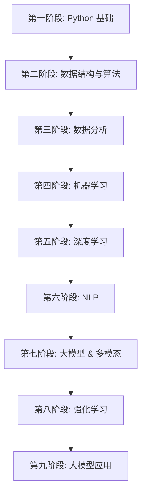

# 人工智能大模型学习项目

[](LICENSE)
[](https://www.python.org/)

## 📚 项目简介

本项目是一个系统化的人工智能大模型学习仓库，涵盖从 Python 基础到大模型应用的完整学习路径。通过 9 个阶段的循序渐进学习，掌握人工智能核心技术栈，包括机器学习、深度学习、自然语言处理、大模型微调、强化学习等前沿技术。

## 🎯 学习目标

- 掌握 Python 编程及人工智能开发基础
- 理解并实现经典数据结构与算法
- 熟练使用数据分析工具进行数据处理与可视化
- 深入理解机器学习核心算法原理
- 掌握深度学习框架（PyTorch）及神经网络构建
- 精通自然语言处理技术及 Transformer 架构
- 熟悉大模型微调、多模态、RAG 等前沿技术
- 理解强化学习及 RLHF 算法
- 具备大模型实际应用开发能力

## 📋 课程大纲

本课程分为 **9 个阶段**，每个阶段包含核心技术学习和实战项目：

### [第一阶段：Python -- 人工智能语言基础](./01-python-basics/)

**学习目标**：掌握 Python 编程基础，为 AI 开发打下坚实基础

**核心内容**：
- Python 基础语法（变量、数据类型、运算符、流程控制）
- 数据结构（字符串、列表、字典、元组、集合）
- 函数式编程（函数定义、参数、装饰器、闭包）
- 面向对象编程（类、继承、多态、设计模式）
- 文件操作与异常处理
- 网络编程（多进程、多线程、Socket、HTTP）
- 正则表达式
- 高级特性（生成器、迭代器、元类）

**实战项目**：
- 愤怒的小鸟游戏
- 客户信息管理系统
- 企业级 Web 框架 Starlette 应用

---

### [第二阶段：数据结构与算法 -- 人工智能的灵魂](./02-algorithms/)

**学习目标**：理解常见数据结构与算法，培养算法思维

**核心内容**：
- 基础数据结构（链表、栈、队列）
- 排序算法（快排、归并、堆排序等）
- 查找算法（线性查找、二分查找、哈希查找）
- 高级算法思想（递归、动态规划、贪心、回溯）
- 时间复杂度与空间复杂度分析

**典型问题**：
- 数组问题、字符串问题、链表问题
- 查找问题、递归问题
- 动态规划问题、贪心问题、回溯问题

---

### [第三阶段：数据分析 -- 数据驱动的时代](./03-data-analysis/)

**学习目标**：掌握数据分析工具链，具备数据处理和可视化能力

**核心内容**：
- **Linux 基础**：常用命令、Shell 脚本、环境配置
- **MySQL**：SQL 语句、数据库设计、多表操作、开窗函数
- **NumPy**：数组操作、矩阵运算、统计函数
- **Pandas**：数据导入导出、数据清洗、数据聚合、透视表
- **数据可视化**：Matplotlib、Seaborn、Pandas 绘图

**实战项目**：
- 房价走势分析

---

### [第四阶段：机器学习 -- 智能时代的核心引擎](./04-machine-learning/)

**学习目标**：理解机器学习核心算法原理，具备建模能力

**核心内容**：
- **数学基础**：微积分、线性代数、概率论
- **机器学习概述**：算法分类、建模流程、特征工程
- **监督学习算法**：
  - K 近邻（KNN）
  - 线性回归（正规方程法、梯度下降）
  - 逻辑回归（Sigmoid、损失函数、混淆矩阵）
  - 决策树、朴素贝叶斯、支持向量机（SVM）
  - 集成学习（AdaBoost）
- **无监督学习算法**：K-means 聚类
- **模型评估**：MAE、MSE、RMSE、精确率、召回率、F1-score、ROC、AUC
- **特征工程**：特征选择、特征降维（PCA）

---

### [第五阶段：深度学习 -- 让 AI 像人类一样思考](./05-deep-learning/)

**学习目标**：掌握深度学习框架和神经网络构建

**核心内容**：
- **PyTorch 基础**：张量操作、自动微分、神经网络构建
- **神经网络**：
  - 多层感知机（MLP）
  - 激活函数（ReLU、Sigmoid、Tanh）
  - 损失函数、反向传播算法
  - 优化器（SGD、Adam）、正则化、Dropout
- **卷积神经网络（CNN）**：卷积层、池化层、经典架构
- **循环神经网络（RNN）**：LSTM、GRU、词嵌入

**实战项目**：
- **项目一：智图寻宝**（基于深度学习的商品图片搜索系统）

---

### [第六阶段：NLP 自然语言处理 -- 人工智能皇冠上的明珠](./06-nlp/)

**学习目标**：精通 NLP 核心技术和 Transformer 架构

**核心内容**：
- **NLP 基础**：文本预处理、文本张量表示、数据增强
- **序列模型**：RNN、LSTM、GRU、Bi-LSTM
- **注意力机制**：Self-Attention、Multi-Head Attention、Seq2Seq
- **Transformer**：
  - 架构原理（编码器、解码器）
  - 位置编码、多头注意力机制
  - 前馈神经网络
- **预训练模型**：
  - BERT（MLM、NSP、双向 Transformer）
  - GPT（自回归语言模型）
  - ELMO（上下文词向量）
- **NLP 工具**：fastText、Transformers 库
- **迁移学习**：预训练模型微调

**实战项目**：
- **项目二：AI 智评**（深度学习技术）
- **项目三：智荐图谱**（基于知识图谱的电商搜索和推荐）
- **项目四**（三选一）：
  - **智选新闻**（智能新闻分类、推荐和摘要）
  - **智医助手**（智能医疗对话机器人）
  - **AI 智教**（在线教育智能分析平台）

---

### [第七阶段：大模型 & 多模态 -- 国产大模型落地标配](./07-llm-multimodal/)

**学习目标**：掌握大模型微调技术和多模态模型原理

**核心内容**：
- **大模型核心原理**：
  - LLaMA 系列
  - GLM 系列（ChatGLM）
  - Qwen 系列（通义千问）
  - DeepSeek 系列
- **大模型微调**：
  - 微调核心要素（数据收集、评估）
  - PEFT（参数高效微调）：LoRA、QLoRA、Adapter
  - 全参数微调
  - 思维链技术（CoT、ToT、GoT、AoT）
  - DPO（直接偏好优化）
- **多模态模型**：
  - Vision Transformer（ViT）
  - CLIP（对比学习）
  - BLIP/BLIP-2（视觉语言预训练）
  - LLaVA（多模态对话）
  - Qwen-VL（通义千问视觉版）

**实战项目**：
- **项目五：智服在线**（可视化 AIGC 问答系统）
- **项目六**（三选一）：
  - **保险反诈**（智能欺诈预测系统）
  - **AI 学情**（智能学习分析系统）
  - **智荐广告**（广告推荐和预测系统）
- **项目七：RAG 项目**（RAG 集成、端到端问答系统）
- **项目八：多模风控**（多模态电商风险控制系统）

---

### [第八阶段：强化学习 -- AI 决策优化的智慧钥匙](./08-reinforcement-learning/)

**学习目标**：理解强化学习原理，掌握基于 RLHF 微调大模型

**核心内容**：
- **强化学习基础**：
  - 多臂老虎机问题
  - 马尔可夫决策过程（MDP）
  - 贝尔曼方程
  - 动态规划法
  - 蒙特卡洛方法
  - 时序差分（TD）方法
- **深度强化学习**：
  - Q-Learning
  - Deep Q-Network（DQN）
  - 策略梯度法
- **大模型微调**：
  - A2C 算法
  - PPO（近端策略优化）
  - RLHF（基于人类反馈的强化学习）

---

### [第九阶段：大模型应用 -- 模拟人类，为你工作](./09-llm-applications/)

**学习目标**：具备大模型实际应用开发能力

**核心内容**：
- **提示工程**：
  - 指令模型和推理模型提示词规则
  - Prompt Engineering 最佳实践
- **模型部署**：
  - DeepSeek 大模型部署方式
  - 本地部署、API 调用
- **应用场景**：
  - 大模型 + 办公软件（提升工作效率）
  - 个人知识库搭建
- **AI Agent**：
  - Coze 平台使用
  - Dify 在线平台使用
  - Dify 本地部署
- **工作流**：
  - Coze 工作流实现
  - Dify 工作流实现

---

## 🚀 快速开始

### 环境要求

- Python 3.8+
- PyCharm（推荐）
- Linux 系统（虚拟机或 WSL）
- MySQL 5.7+
- PyTorch 1.12+
- CUDA 11.0+（用于 GPU 加速，可选）

### 安装步骤

1. **克隆项目**

```bash
git clone https://github.com/your-username/llm-learning.git
cd llm-learning
```

2. **创建虚拟环境**

```bash
python -m venv .venv
source .venv/bin/activate  # Linux/Mac
# 或
.venv\Scripts\activate  # Windows
```

3. **安装依赖**

**⚠️ 重要：** 不建议直接运行 `pip install -r requirements.txt`，因为某些包需要特定环境。

**推荐方式：** 根据学习进度分阶段安装，详见 [安装指南](./docs/installation-guide.md)

```bash
# 快速开始（基础包）
pip install numpy pandas matplotlib scikit-learn jupyter

# 或者按阶段安装
# 第三阶段 - 数据分析
pip install numpy pandas matplotlib seaborn

# 第五阶段 - 深度学习
pip install torch torchvision torchaudio

# 第六阶段 - NLP
pip install transformers tokenizers datasets
```

📖 **完整安装说明请查看：[docs/installation-guide.md](./docs/installation-guide.md)**

4. **配置环境**

根据各阶段学习内容，按需配置 Linux、MySQL、PyTorch 等环境。

---

## 📂 项目结构

```
llm-learning/
├── 01-python-basics/             # 第一阶段：Python 基础
│   ├── 01-basics/                # 基础语法
│   ├── 02-oop/                   # 面向对象编程
│   ├── 03-advanced/              # 高级特性
│   └── 04-projects/              # 实战项目
├── 02-algorithms/                # 第二阶段：数据结构与算法
│   ├── 01-data-structures/       # 数据结构
│   ├── 02-sorting/               # 排序算法
│   └── 03-problems/              # 算法题解
├── 03-data-analysis/             # 第三阶段：数据分析
│   ├── 01-linux/                 # Linux 基础
│   ├── 02-mysql/                 # MySQL 数据库
│   ├── 03-numpy/                 # NumPy
│   ├── 04-pandas/                # Pandas
│   └── 05-visualization/         # 数据可视化
├── 04-machine-learning/          # 第四阶段：机器学习
│   ├── 01-math/                  # 数学基础
│   ├── 02-supervised/            # 监督学习
│   ├── 03-unsupervised/          # 无监督学习
│   └── 04-feature-engineering/   # 特征工程
├── 05-deep-learning/             # 第五阶段：深度学习
│   ├── 01-pytorch/               # PyTorch 基础
│   ├── 02-cnn/                   # 卷积神经网络
│   ├── 03-rnn/                   # 循环神经网络
│   └── 04-project-image-search/  # 项目一：智图寻宝
├── 06-nlp/                       # 第六阶段：NLP
│   ├── 01-preprocessing/         # 文本预处理
│   ├── 02-transformer/           # Transformer
│   ├── 03-bert/                  # BERT
│   ├── 04-project-ai-review/     # 项目二：AI 智评
│   ├── 05-project-knowledge-graph/ # 项目三：智荐图谱
│   └── 06-project-optional/      # 项目四（三选一）
├── 07-llm-multimodal/            # 第七阶段：大模型 & 多模态
│   ├── 01-llm/                   # 大模型原理
│   ├── 02-fine-tuning/           # 模型微调
│   ├── 03-multimodal/            # 多模态模型
│   ├── 04-project-aigc-qa/       # 项目五：智服在线
│   ├── 05-project-optional/      # 项目六（三选一）
│   ├── 06-project-rag/           # 项目七：RAG 项目
│   └── 07-project-risk-control/  # 项目八：多模风控
├── 08-reinforcement-learning/    # 第八阶段：强化学习
│   ├── 01-basics/                # 强化学习基础
│   ├── 02-deep-rl/               # 深度强化学习
│   └── 03-rlhf/                  # RLHF
├── 09-llm-applications/          # 第九阶段：大模型应用
│   ├── 01-prompt-engineering/    # 提示工程
│   ├── 02-deployment/            # 模型部署
│   ├── 03-ai-agent/              # AI Agent
│   └── 04-workflow/              # 工作流
├── docs/                         # 文档
├── discuss/                      # 讨论和方案
├── requirements.txt              # 依赖列表
├── LICENSE                       # 许可证
└── README.md                     # 项目说明
```

---

## 📖 学习路线

### 建议学习顺序



### 学习建议

1. **循序渐进**：严格按照阶段顺序学习，每个阶段都为后续阶段打基础
2. **理论结合实践**：学习每个知识点后，完成对应的编程练习
3. **项目驱动**：认真完成每个实战项目，巩固所学知识
4. **笔记总结**：及时记录学习笔记，整理知识体系
5. **社区交流**：遇到问题及时查阅文档或在社区求助

---

## 🎓 核心项目列表

| 项目编号 | 项目名称 | 技术栈 | 难度 |
|---------|---------|--------|------|
| 项目一 | 智图寻宝（商品图片搜索） | CNN、图像检索 | ⭐⭐⭐ |
| 项目二 | AI 智评（智能评分系统） | LSTM、文本分类 | ⭐⭐⭐ |
| 项目三 | 智荐图谱（知识图谱推荐） | Neo4j、NLP | ⭐⭐⭐⭐ |
| 项目四-1 | 智选新闻（新闻分类推荐） | Transformer、摘要 | ⭐⭐⭐⭐ |
| 项目四-2 | 智医助手（医疗对话机器人） | BERT、对话系统 | ⭐⭐⭐⭐ |
| 项目四-3 | AI 智教（教育分析平台） | 多任务学习 | ⭐⭐⭐⭐ |
| 项目五 | 智服在线（AIGC 问答） | LLM、Prompt Engineering | ⭐⭐⭐⭐⭐ |
| 项目六-1 | 保险反诈（欺诈预测） | LLM、异常检测 | ⭐⭐⭐⭐ |
| 项目六-2 | AI 学情（学习分析） | 多模态、数据分析 | ⭐⭐⭐⭐ |
| 项目六-3 | 智荐广告（广告推荐） | 推荐系统、CTR 预估 | ⭐⭐⭐⭐ |
| 项目七 | RAG 项目（检索增强生成） | RAG、向量数据库 | ⭐⭐⭐⭐⭐ |
| 项目八 | 多模风控（风险控制） | 多模态、风控模型 | ⭐⭐⭐⭐⭐ |

---

## 🛠️ 技术栈

### 编程语言
- Python 3.8+

### 深度学习框架
- PyTorch
- TensorFlow (可选)

### 数据处理
- NumPy
- Pandas
- Scikit-learn

### 数据可视化
- Matplotlib
- Seaborn

### NLP 工具
- Transformers (HuggingFace)
- fastText
- NLTK
- SpaCy

### 大模型
- LLaMA / LLaMA2
- ChatGLM
- Qwen
- DeepSeek

### 数据库
- MySQL
- Neo4j (知识图谱)
- ChromaDB / Milvus (向量数据库)

### 开发工具
- PyCharm
- Jupyter Notebook
- Git

---

## 📝 文档说明

- **docs/**：存放正式文档，包括每个阶段的学习笔记、技术文档等
- **discuss/**：存放讨论和评审的计划、方案等文档

---

## 🤝 贡献指南

欢迎贡献代码、完善文档或提出建议！

1. Fork 本仓库
2. 创建特性分支 (`git checkout -b feature/AmazingFeature`)
3. 提交更改 (`git commit -m '添加某个特性'`)
4. 推送到分支 (`git push origin feature/AmazingFeature`)
5. 提交 Pull Request

---

## 📜 许可证

本项目采用 MIT 许可证。详见 [LICENSE](LICENSE) 文件。

---

## 📧 联系方式

如有问题或建议，请通过以下方式联系：

- 提交 [Issue](https://github.com/your-username/llm-learning/issues)
- 发送邮件至：your-email@example.com

---

## 🌟 致谢

感谢所有开源项目和社区的支持，特别是：

- [PyTorch](https://pytorch.org/)
- [HuggingFace Transformers](https://huggingface.co/transformers/)
- [Scikit-learn](https://scikit-learn.org/)

---

**开始你的 AI 学习之旅吧！🚀**
